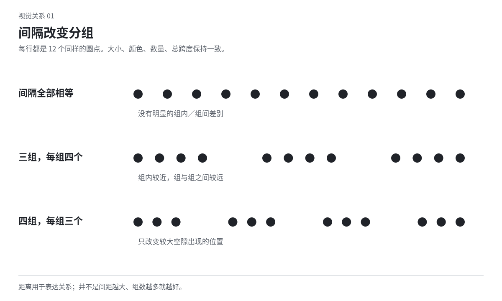

# 01 视觉语法：从看见元素到看见关系

同样十二个点，可以排成四组、两条线、一个轮廓或一片纹理。元素没有增加，关系已经改变。设计时先学会辨认这种改变，才不至于把“更好看”理解为不断换素材。本章的点、线、面是分析方式，同一个对象可以在不同观看尺度下承担不同角色。

## 点、线、面是相对于画幅和观看距离而言的

点指局部集中的视觉单位，不一定是圆点。远处一个人、一处红色标点、一颗高光，在整体中都可能像一个点。它的位置会把注意带向中央、角落或边界；几个点靠近会形成组，沿某种方向展开会形成隐含的线。

线可以来自实际笔画，也可以来自一组对齐的边缘、人物的朝向或连续的空隙。看线时不只看粗细，还看它从哪里起、哪里结束、是否中断、沿途怎么改变方向。一条指向页外的线会延长画外想象；首尾封闭的线会围出一个区域。

面指占据区域的形。照片可以是一个面，正文也可以是灰色的面。先把一段文字当面看，能发现它与图片是否同样浓重、右侧边缘是否参差、与标题之间的空白是否割断关系；再放大回到逐字阅读。不要一直停在逐元素的局部上。

教学试法：用十二个同样大小的圆，不改颜色与数量，只改变间隔。先形成三团，再拉成一条有两次停顿的长带，最后排成近似环形但留一个开口。比较组数、方向和开口如何变化。这里训练的是关系，不是证明十二个圆就能成为好作品。

## 先分清形、轮廓、内部结构与表面

形是对象整体占据的区域；轮廓是这一区域与周围相遇的边；内部结构说明各部分怎样连接；表面是纹理、颜色、明暗等局部变化。一把椅子的外形像凳子时，增加木纹不会补出椅背；一个标题内部太碎时，给外面加投影也不一定能使它成为完整字块。

看造型可以暂时把内部细节压到同一色，检查姿态、长短和关键空隙。若人物持物的动作因此消失，要分清是手臂与身体连成一团，还是持物只靠表面细节说明。需要清楚姿态时调整轮廓；需要隐藏动作的主题则可以保留含混。

轮廓清楚不等于所有边都必须硬。暗衣袖融进暗背景时，局部轮廓可以缺失；袖口和手的位置仍能使人补出胳膊。反过来，剪纸的魅力可能就在连续、准确的硬边。先看哪种信息正在承担辨认。

## 接近与相似怎样建立组

较靠近、形态相似、共用区域或连续相接的元素，常更容易被组织在一起。这些线索可以互相支持，也可以竞争。格式塔知觉研究讨论的是此类组织现象，不能据此宣布某一种版式最美，或预测所有人的固定阅读顺序。[研究范围](sources.md#s04)

例如三张图片各带一句图注，图注离自己的图很远、离下一张图反而更近，语义关联容易含混。先把图注靠回对应图，并让图与图之间留出另一种距离。无需同时增加底色、阴影、编号、箭头四种重复说明。

相似可以跨越距离。一页中所有作品年份使用同一种字重和共同位置，即使分布在不同栏，读者仍可把它们当成同一类。相似也可能误导：警告与普通备注使用相同醒目标记，类别便不够清楚。

当接近和相似冲突时，决定任务更需要按哪一种关系阅读。比较同一人的不同年份数据，按人分组可能比每年都换色更有用；希望比较每年的总体变化，就可以改为按年份聚合。颜色不是替代信息结构的万能办法。

图中三种安排使用相同元素，区别只在间隔。观察每组之间的空处是否足以被读出。示意没有为现实画面规定固定的组内、组间比例。

## 连接、延续和共同运动

两条线在遮挡物前后的方向相近，可能被读成同一条延续的线。一张照片里的道路可以接到版面分隔线；如果接点不准，观众可能把它们看成互不相干的装饰。要发展这种关系，调整接近角度、粗细和被遮挡的长度。

动效里，几块形同步转向、共享速度变化，也可以被理解成一组。一个标签随对象移动，二者的关联通常比标签留在原处更明确。但当标签本来是坐标或固定刻度时，就不该随对象走。运动关系必须符合它的角色。

连续不必始终完整。故意在一条稳定轨迹里断开一段，会让断口成为事件；每一处都断开，重点就可能转向整体纹理。不要把“增加节奏”只理解为均匀地删掉每隔一段线。

## 图与底：同一边界可能有两种读法

图是被看作对象的区域，底是它周围或后面的区域。一个黑色杯子里的白色把手孔，既可以读成空洞，也可以成为一块有方向的形。设计标志、剪纸和字形时，应当同时看实体与空处，而非把空处当作剩下的无关背景。

想让两种读法都出现，需要让各自的轮廓有足够线索。两个人的侧脸之间形成一只瓶子时，只把空隙说成瓶子并不够；要观察瓶口、肩部和底部是否真的有可见关系。如果只想快速读出侧脸，第二种读法反而可能增加不必要的迟疑。

图底转换不只用于谜图。深色字内的一条贯通白缝，可以与页面留白相连，让字像被切开的物体。版面底色有了自己的形，文字便不再只是浮在背景上。

## 视觉重量不是面积的简单加总

视觉重量是“看起来多占据注意、使画面向哪边倾”的工作描述，不是一条精确物理公式。大小、明暗对比、颜色强度、细节密度、孤立程度、位置和语义都会参与。一个小而孤立的亮点，可能比一块面积更大的浅灰纹理醒目。

排两个面积一样的字块，一个笔画密、另一个开口大，二者未必同样重。把它们等距放在轴线两侧，数值对称也未必视觉对称。需要安定时可以调整尺寸、距离或浓度；需要倾斜与压力时则可以保留不等。

不要补偿过度。右边已有一大块浓重图片，再在左边补满装饰，可能消除空白，使两边都过满。先问偏重是否有作用，再决定是移动重心、改变面积，还是维持悬置。

## 层次与显眼是两回事

显眼说明某个部分容易先引起注意；层次说明信息之间有怎样的重要程度和所属关系。一个很亮的装饰能显眼，却不一定帮助层次。标题、章节名、正文和脚注即使只用黑白，也可以通过大小、位置、间距和重复构成层次。

建立层次时，先标明角色，再选择差异。例如主标题的“大”与章节名的“粗”可分别承担不同任务；不要让每一种角色都同时改变字体、颜色、背景和位置。也不必用严格的字号比构成整套比例，实际字面和内容长度会影响结果。

有些作品支持游移观看，没有固定的第一、第二、第三步。此时检查局部是否有可进入的关系、跨区域是否有呼应，不能把“没有单一焦点”直接判为失败。海报、纹样、地图与一幅群像可以采用不同组织。

## 对比要看同一维度中的距离

粗与细、大与小、疏与密、直与曲、整与碎都可以形成对比。对比并非所有地方都取极值。两个字重已经拉开时，颜色可以接近；几何与手绘已经差异明显时，不必再给两者各加一种强烈材质。

缺少对比时，先找出观众应辨认的关系，再扩大该维度。例如标题与正文都像灰块，可能只需让标题的字面宽度或行间显著不同。若作品需要近乎单色的柔和层次，就可以把变化放到面积、边缘或细微粗糙度中。

强对比也可能抵消自己。每个元素都使用发光、渐变和阴影，彼此会重新接近，画面又变成平均的热闹。尝试让一个区域真正简单，另一个区域真正复杂，或建立连续的大色域，而非继续给所有地方加亮。

## 在三个尺度之间来回看

缩略图适合看主要形、密度和观看入口；实际尺寸适合看文字与细节是否有用；局部放大适合看字偶、接缝、轮廓和材质。三者回答不同问题。局部完美不能证明整体成立，缩略图漂亮也不能证明正文读得下去。

不要把缩小测试变成对所有作品的唯一审判。细密地图在缩略图中可能只是一片纹理，原尺寸才出现路径；针脚式图案也依赖近看。应该判断作品在它真正需要发挥作用的距离上提供了什么。

本章练习可以只选一个：保持所有元素不变，改分组；保持构图不变，改图底；保持颜色不变，改视觉重量。练习之后用一句话描述实际变化，比如“日期终于与对应场次连成一组”，不要只说“层次更好”。
