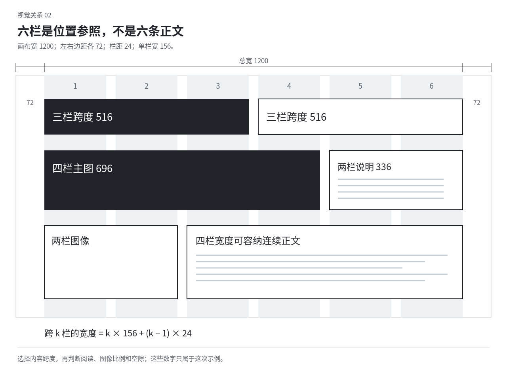

# 04 网格与版式：从内容推导结构

网格是一组可反复借用的位置关系。它帮助文字、图片和标注共用边缘，也帮助不同页面有联系。网格本身不会使设计好看；它可以支撑严整、热烈、破格或高密度的布局。先知道要组织什么，再选择网格的结构与精细程度。

Vignelli 对网格和书籍的讨论、IBM 的跨媒介网格说明，均把网格用于组织内容与比例。两者各有自己的风格主张，本教材借用结构方法，不把它们的字体、倍数或栏数当作普遍审美标准。[S02](sources.md#s02) [S03](sources.md#s03)

## 先认识页面里的几种不同空间

页面或画布是全部范围。版心是主要承载内容的区域；页边距是版心与外边界之间的距离。栏是版心内部的竖向分区，栏距是相邻栏之间的空处。行或横向分区把内容放到不同高度；栏与横向分区相交形成模块。

基线是字体排列时参照的线，基线网格由一组重复的基线组成，常用于连续正文的纵向节奏。它与画面上每隔若干单位画一条辅助线不同，也不代表所有图片、标题和装饰都必须贴在每条线上。

这些结构可以部分采用。一个极简海报可能只有两条共同边缘；一本参考手册可能需要栏、模块和基线共同工作；一件自由拼贴可能依靠内容轮廓而不使用均分网格。不要先画最复杂的网格再强迫内容适配。

## 内容是怎样决定栏数的

先看需要并置的东西：一段持续阅读的正文、一张需要保留全貌的竖图、若干短注释，还是一列需要横向比较的数字？长正文需要足够行长；短图注可以窄；图像的原比例可能留下可用空处。

假设页面主要是长正文和边注，可以用一宽一窄的结构；主要是四项并列比较，则可以用相容的列；图片比例变化大，细分的逻辑栏有助于组合不同跨度。栏数是这些需求的结果，不是先背“网页十二栏、海报三栏”。

逻辑栏不等于实际文本栏。六栏网格可以让一段正文占三栏、主图占四栏、图注占两栏。一段长文真的排成六条细条，行太短而不断换行，可能破坏阅读。

## 一次可以核算的网格推导

设画布宽度为 W，左右页边距为 L、R，分为 n 栏，栏距为 g。可用宽度是 W−L−R，其中有 n−1 个栏距。因此单栏宽度：

`c = (W − L − R − (n − 1) × g) / n`

连续占 k 栏的内容，包含 k 栏和 k−1 个内部栏距，其宽度为：

`span(k) = k × c + (k − 1) × g`

教学设定：画布宽 1200 单位，左右边距各 72，六栏，栏距 24。可用宽度是 1056，五个栏距合计 120，单栏宽 156。三栏跨度为 516，四栏跨度为 696。这里的单位可以是某一设计里的逻辑单位；并非推荐所有画布使用这些参数。

一张竖图占两栏，宽 336；如果原图宽高比为 2:3，高为 504。现在应观察它与旁边正文的长短、标题和下方空处，而不是把高度强行拉成整齐正方形。数学提供可靠位置，视觉判断选择哪些位置值得用。

上图的六栏是可组合的参照，下方内容并没有拆成六栏正文。先看图文需要占多少范围，再决定使用哪几条边。

## 用真实行长检查网格能否承载内容

教学设定：一页宽 148 毫米，左右边距分别 18 与 14 毫米，版心宽 116 毫米。若中文正文字号为 10.5 点，按一个全角字约占一个字号宽度粗估，一个字约 3.70 毫米，一行约容纳 31 个全角字。标点压缩、中西文和字距会改变实际结果。

若把版心再分两栏、栏距 6 毫米，每栏只有 55 毫米，粗估约 15 个全角字。对于计划中的长篇叙述，这可能太窄；对于短条目、注释或诗行，可能适用。应先看真实内容，而非因为“两栏更像杂志”就采用。

英文的建议字符数不能直接移植为中文字数。比例字体的字母宽度不同，中文还受标点与混排影响。数字估计用于发现明显问题，最终需要检查实际排出的段落。[文字行长的不同口径](sources.md#s08) [中文排版](sources.md#s11)

## 页边距既有实际限制，也塑造气质

靠近边缘的文字会产生贴近、逼迫或海报式张力；较宽边距会突出中心内容，也可能使小内容显得空洞。页边距应该与主体尺度共同决定，不能先设一套“高级留白”。

书籍内侧还有装订关系，包装上还有折线与粘接区域，户外展示可能有框架遮挡。保留必要空间不代表所有边必须等宽。下边距可以为手持留出位置，外侧可以容纳边注，顶部也可能有明确的页眉区域。

出血是裁边外的图像延伸，页边距是成品内部的内容空间，二者不能混淆。贴边图像可以跨出成品边界，必要小字却应留在足够可靠的位置。具体印刷余量见[载体章节](10-print-surface.md)。

## 垂直节奏从正文、标题和内容组共同产生

正文每行基线间隔相同，会形成连续节拍。例如正文采用 12 点字、18 点基线间距，可以把段前、段后的一些距离设为相容的间隔，使多栏的文字更容易互相呼应。这个例子描述关系，不推荐统一的 1.5 倍行距。

标题可以不服从正文的每条基线。展示标题的字形高度、标点和断行，可能需要独立的行间。强迫巨大标题按正文节拍走，会导致过松或过紧；可以只让标题组的开始或结束与正文的结构呼应。

多栏正文基线需要齐时，检查首行起点、行距和段落间隔，而不只把文本框顶端对齐。两栏字体不同、实际行高不同，却强行在底边拉齐，会使其中一栏的内部节奏被扭曲。

## 对齐的对象要具体

可以对齐文本可见左边、图片裁边、数字的小数点、标题的基线、某个形的中心，也可以沿一条斜轴排列。不要把“对齐”全部理解为所有文本框左上角相同。

同一组内容应采用足够稳定的对齐关系，方便识别；不同角色可以有不同锚点。例如作品标题与图片左边齐，年份与右边齐，长注释留在共同的窄栏。读者因此能形成查找方式。

坐标一致而视觉不齐时，进入字体的光学问题。开头引号、字边空白和圆形轮廓可能造成偏移。不要因局部字形需要微调，就推翻全部网格；也不要为守住一条线而保留明显视觉空洞。

## 栏距、组距与段距不该全都一样

间距承担不同含义。标题到正文是“属于这段”，段落之间是“同一文章中的停顿”，两个模块之间是“不同内容组”，页边距是“内容与载体的关系”。全部使用同一个间距，会削弱这些差别。

可以建立少量相关间距，但倍数是控制一致性的办法，不是审美定律。较小间距不一定恰好是较大间距的一半；图片内部的可见空白也会影响距离感。边缘已经自带大面积浅色的图片，未必需要与满幅密图同样的外部空隙。

尝试只调整组间距离，保持组内不变，再只调整组内。比较哪一次改变让内容层次更清楚。不要一遇到拥挤就全页统一增加内边距。

## 破格怎样依然有关系

让标题跨栏、图片越边、注释偏移，可以突出内容或形成冲突。选择它突破的具体参照：原本稳定的基线、共同的图片边界、规则的密度，或一个连续序列。偏离产生的空间要继续与其他部分发生关系。

例如两栏正文稳定，主图突然跨过两栏并越到外边距，可以形成开敞；如果每一行正文也跟着随机错位，原来的跨越就没有清楚参照。也可以从一开始采用自由构图，但那时应依靠形、方向和疏密组织，而非名义上“破网格”。

不要让网格抹掉唯一有趣的地方。一张图的特殊比例留下漂亮的窄缝，可以调整邻近信息回应它，而不为了统一高度先裁掉图。能看见的关系优先于看不见的辅助线。

## 一个系列可以共用结构，不共用全部坐标

几张海报可以共用标题与日期的角色、共同边缘和颜色组织，主图每次根据内容改变跨度。一本书可以共用版心与导航，却让章节页、图录页和正文页有不同节奏。若每页只替换标题与图片，系列容易变成模板填空。

变化太多时，先恢复少量可靠关系，如页码、图注或正文的共同位置；变化太少时，选择内容允许改变的跨度和空白。不要同时更换所有字体、栏数与图像处理，之后再靠同一个角落标志宣称统一。

## 版式失效时先检查这些原因

对齐很多却仍凌乱，可能是锚点太多、角色混淆或尺度没有区分；网格很规整却无力，可能是每项都占等大空间；正文像细条，可能是实际文字栏过窄；跨页不连贯，可能是只设计了单页；版面空洞，可能是内容尺度与边距不相称。

本章局部练习：保持相同文字和图片，分别试“正文跨三栏、图跨三栏”与“正文跨两栏、图跨四栏”，再试不裁图而改变留白。记录阅读、尺度与图文主从分别发生什么。不按哪种安排更接近模板选择。
