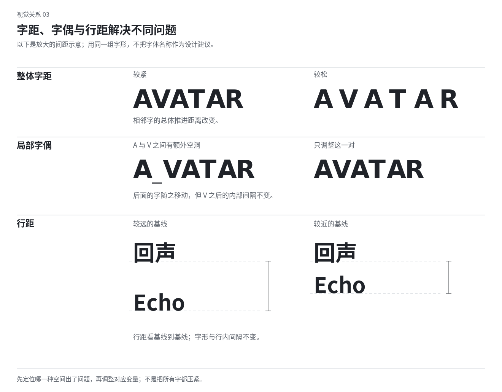

# 05 字体与排版：把文字读成内容，也看成形

文字既有语言内容，也有宽窄、浓淡、方向和节拍。排版包括选择字形，以及安排字、词、行、段和页面之间的关系。找到一个漂亮字体只完成其中一部分；真正的判断需要放入实际词句、标点、数字和观看尺寸。

## 先认识字形里可以观察的部分

字号描述字体使用的名义尺寸，不等于可见字形高度。字体的设计方框通常称为 em，不同字体在方框内占的面积不同。同样 24 点的两种字，可能一个明显高大，另一个显得轻小。

西文字形可观察大写高度、小写主体高度、上伸与下伸部分；中文可观察字面大小、重心、内部空间与横竖笔画关系。字内封闭空处常称字腔，开向外部的地方称开口。细小尺寸下，过小开口和过密交接可能先失去辨认。

笔画反差指一字中粗笔画与细笔画的差距；端部指笔画怎样结束；字宽影响文字能形成宽阔带状还是紧凑块面。先看这些可见特征，再讨论“现代”“优雅”“亲切”，避免把有无衬线当成全部性格。

## 把角色分开，再选择字体

展示标题承担形与语气，正文承担持续阅读，标签承担快速识别，数字承担比较，说明承担补充。它们可以共用一个家族，也可以用互补的字体。字体数量不设审美硬上限，但每次引入一种新字体，应当知道它在角色或表现上增加了什么。

一种安全的探索方式是保持正文稳定，把形式发明集中到标题；另一种是使用同一家族的宽窄、粗细或光学尺寸变化；还可以让正文与标题明显相撞。选择取决于内容和篇幅，不把“最多两种字体”当成专业证明。

教学例：为一页演出介绍选字，先排完整演出名、两段介绍和日期。“潮汐剧场”四字好看，却不代表含有括号、英文姓名和长标题的整页合适。发现缺字或字重不全时，应在方向仍可调整时处理，而不是让系统随机替补某几个字。

## 字体搭配看相容与差异各发生在哪里

两种字体可以共享某些骨架或比例，同时在粗细、宽窄、端部或书写感上区分。若它们过于接近但又细节不同，可能像无意换字；若每一处都不同，又可能互相争抢。观察整段的浓度和形状，不只并排比较字体名称。

搭配也可以采用明确反差。紧窄的重标题配开放的正文，几何大字配手写边注，都有空间。关键是分配角色和面积：手写字只出现在确实像注释的位置，比每句话都换手写更有组织。

不要用一个陌生字体承担所有“艺术感”。版式、行距、断行和图文关系没有改变时，新字体常只成为换皮。反过来，普通字体经过有力的尺度和排列，也可以形成鲜明作品。

## 字距与字偶间距解决不同问题

整体字距调整一段或一串字之间的间隔；字偶间距只调整某一对字符。前者改变整体疏密，后者修局部空洞或拥挤。字本身还有字边空白，所以两个文本框相接并不等于字形之间没有空间。[术语依据](sources.md#s12)

例如“A V”之间的斜边造成空洞，而后面的“E R”正常时，先修这一对，不把整行一起压紧。如果每一对都松，文字像散落的字牌，再调整体。反过来，有意疏排的短标题可以保留间隔，但需观察是否还能被读成一句。

中文大标题不能直接套西文字偶的感受。横竖密集的字与笔画较少的字相邻，视觉空白会不同；多数正文应优先依靠字体与排版引擎处理，展示标题才做有限校正。过密会使笔画粘连，过疏会打散词组，均不自动更精致。

## 行距是基线的间隔，不只是两行之间那条白缝

行距通常以相邻行的基线距离来控制。字形有不同高度、上伸和下伸，所以相同数值可能留下不同的可见白缝。全大写标题与大小写混合标题，或中文字与西文混排行，不必使用同一视觉间隔。

“12/18”可表示 12 点字、18 点基线间距。这只描述排法，并不保证舒服。正文的行长、字体浓度和内容复杂度都会改变感受；较长行可能需要更清楚的行间引导，较短展示标题则可以靠近成块。[长文间距的作者建议与边界](sources.md#s08)

两行标题像独立标签时，先收近行间或重新断行；正文堵成灰墙时，检查行长和行距，而非只把字变细。如果字本来已经细弱，继续减字重会损害阅读。

示意中的字形是关系演示，不是推荐字样。真正排版需要在实际字体里观察空隙，而非机械使用图中的距离。

## 行长影响回行与段落形状

一行过长，读完后回到下一行起点可能费力；过短则频繁换行，词句被切得零碎。具体长度依赖文字系统、字体和任务，不存在把英文字母数量直接换成汉字数量的通用值。

对中文可以用“文本宽度除以单字近似占宽”作粗估，再用真实段落检查标点、中西文与不同字宽。英文还要看平均词长和空格。不要为了装进一个既定卡片，持续缩小正文直到它变成装饰。

教学试法：同一段文字保持字号不变，分别排成较宽、适中和窄栏。比较回行频率、段落高度和右侧轮廓。若窄栏用在边注很灵巧，用在长叙述却断裂，说明同一安排在不同角色中有不同价值。

## 断行同时处理语义和形状

标题的断行会改变重音。例如“把光带进／日常”与“把光／带进日常”，短行承担的分量不同。不要只为两行等长拆开紧密词组，也不要为了保持语义完整而忽略极不协调的字块形状。比较真实排法，允许语义与形态共同调整。

长文中的断行更多依赖排版引擎与语言规则，不能逐行硬敲回车来修某个视口。正文缩放或换宽度后应仍可阅读；固定诗行、标题和艺术排版则可以有刻意的行结构。

数字、日期、单位与英文短语应按内容检查。不能让一个范围的连接符孤零零留在一行，也不能无意将关键单位甩到下一行。不要机械禁止所有跨行，应该保住真正需要一起读的单元。

## 左齐、居中、右齐与两端对齐各改变什么

左齐提供稳定的回行位置；右侧自然参差会形成一条可设计的轮廓。居中让每行围绕轴线展开，适合某些短段和仪式性安排，但长文每行起点变化需要谨慎。右齐可以回应图片右边或表达边缘关系，不必因少见就禁止。

两端对齐会把行填到共同宽度，通常通过调整词间、字间或其他可用空间实现。栏太窄或长单词太多时，空隙可能被拉开成纵向白道，也称“河流”。先尝试栏宽、语言断词和排版设置，不用手动插入多个空格补齐。

中文两端对齐还涉及标点压缩与行内调整，不能把西文词间空格的办法直接照搬。教材中的“整齐”指可见的关系可靠，不要求所有段落都成为硬矩形。[S11](sources.md#s11)

## 段落节奏与“文字灰度”

文字灰度指远看时一块正文呈现的浓淡，并非文字必须灰色。字重、字面大小、字距、行距和段落空白共同影响它。两栏使用相同黑色，其中一栏若行间过紧，仍可能明显更浓重。

段落可以靠首行缩进区分，也可以靠段间空白区分，或者结合具体版式选择。不要每一段同时大缩进、大段距、分隔线和底色，重复强调会把长文切碎。需要逐项检索的内容则可以明确分块。

页尾只有一个字、页首只有孤立的一行、标题落在页底而正文全在下一页，都可能打断关系。先调整相关段落的分配、行长或少量间隔，不要全篇压字距来解决一处断页。保留原文时不能擅自删改句子只为排版。

## 光学对齐：对的是可见字面

文本框可能包含字边空白，开头的引号、T、A 或数字 1 也可能让一行看似缩进。大标题可做小幅的光学校正，让可见重量与邻近内容呼应；长正文不应逐字拖动。[S10](sources.md#s10)

居中也要看形状。三角形或播放符号的几何包围框居中后，视觉重量可能偏向宽的一侧；圆形与方形等高时也未必同样大。这类调整是观看上的补偿，不能代替全局结构，也不需要随意扩大每个曲线字。

对齐失效时先确认源头。是字的内部空白、文本框的多余边、标点、不同基线，还是旁边图像本身有透明空处？原因不同，改动对象也不同。

## 中文与西文混排

同字号不保证同等大小，同“400”字重也不保证同等浓度。先将所用中文、英文、数字和标点放在真实句子里，看重心、可见高度与笔画是否相互支持；必要时调整西文的大小、字重或字体选择，而非全句统一放大。

中文标点的字面位置、占宽和压缩习惯会因地区与排版方式而异。句号、逗号、右括号等不宜无意出现在行首，左括号等不宜落在行尾；成组的省略号、破折号也有不拆分的处理。具体以语言和媒介惯例为依据，不只靠字符看起来有空位就拆开。[S11](sources.md#s11)

中西文之间的间隔可以由工具自动处理，先检查已有机制，避免再插空格造成双重间隔。竖排需要考虑西文的旋转、短数字组合以及标点的竖排位置，不能简单把横排逐字旋转。

## 小字号需要的字形不等于把标题缩小

展示字体可能有很细的细笔画、紧密字腔或夸张对比；缩小后这些地方可能先丢失。具有光学尺寸设计的字体会在不同使用尺寸上调整笔画、比例与空间，且并非每个家族都提供这种版本。[S09](sources.md#s09)

小字难读时，可以选择适合正文的字形、扩大实际尺寸、改善背景或减少不必要的细节。直接描边可能使字腔更小，也可能改变字的性格；不能把它作为统一补救。

大字则会暴露局部间距和曲线问题。标题要做得巨大时，检查字偶、轮廓与标点，而不是只把字号拉到最大后视为完成。

## 数字、表格和标签的排版

数值列需要纵向比较时，可使用等宽数字形式，使同样位数有稳定占宽；有小数时可对齐小数点。等宽数字不要求整段正文改用等宽字体。单位放在列头、轴标签还是每个值后，要保持一致并减少误读。

标签的作用通常是快速识别，不应与展示标题争夺所有对比。可以让字体角色相同、关键状态不同。短数字很大、单位太小且离得远时，读者可能先看到数量却无法知道含义，需要恢复二者关联。

## 实验字体从结构开始

可以让字的某条横线延长为图片边界，让开口连通背景，让笔画由折纸、像素或纤维构成。先决定哪些骨架维持辨认，哪些结构可以变化。比起给现成字旋转、描边和加噪点，改变连接与空处更能形成独特字形。

文字也可进入难读或纯图像状态，但要明确其角色。如果展名被转成纹样，可以在另一个稳定位置提供必要名称；若文字本来就是图像素材，未必每个字都要读出。不能让购票日期也因为实验标题而失去入口。

本章练习：保持文案和配色，分别只改断行、整体字距、局部字偶、行间。描述每次改变影响的是形状、语义、浓度还是关联。能分清问题，就不必每次“字体不对”都更换整个字库。
