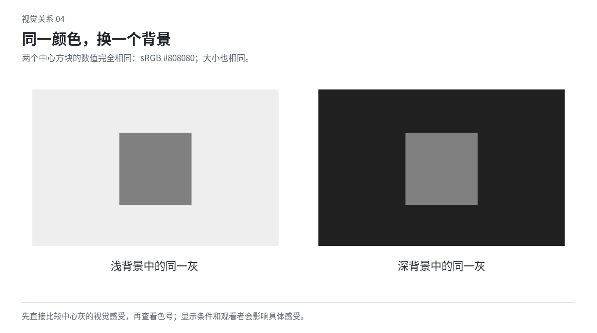

# 06 色彩关系：在面积、邻接与材料中选择颜色

配色设计的对象是一幅正在被观看的画面，不是一排孤立的色卡。相同几种颜色，改变覆盖范围、相遇边界、明暗、密度和载体，就能得到不同效果。先决定颜色在这件作品中做什么，再挑具体色值。

## 分清色相、明度、彩度和透明度

色相是颜色偏红、黄、绿、蓝等的方向；明度在本章指颜色看起来明暗的关系；彩度描述颜色偏离同明度中性色的程度。不同软件对饱和度、亮度、明度的定义并不相同，滑块数值一样不保证感受一样。

透明度控制能看到多少下方内容，不能等同于彩度。把鲜红文字降低不透明度，既改变颜色，也让背景图像进入笔画；它可能变脏、断裂或不可读。需要低彩度红时，可以直接选择相应颜色，而不一定让文字变透明。

先用简单比较训练观察：一组颜色只改明暗，一组只改偏向，一组只改鲜艳程度。实际空间不能总将这些属性完全独立改变，但这种分辨有助于定位问题。不要把所有“不协调”都翻译成饱和度太高。

## 色彩关系从职责开始，但不必只服务信息

颜色可以形成气氛、分组、空间、动作线索，也可以自己成为主题。一个底色可能同时提供氛围与衬托；一个反复出现的颜色可能是身份线索，也可能只是韵律。先决定哪些作用需要稳定，哪些可以自由变化。

艺术画面可以让鲜红铺满全场，功能界面的红则可能已经承担错误状态。同一颜色在不同场景中不需固定含义；同一界面内部若相邻信息复用同色却含义冲突，就需要重新组织。

装饰性作品不必把每个颜色解释成符号。两片色面相接时出现的厚薄、明暗与振动，本身可以值得看。颜色的感官作用不需要额外的象征许可。

## 相同颜色会随周围改变

Albers 的教学强调通过颜色之间的相互作用训练观察。可借鉴的是实际比较，不是背诵一套和谐色表。[S07](sources.md#s07)

把同一块灰放在深底与浅底上，分别观察其亮暗感。把同一片暖色放在冷色与相近暖色旁，也观察它是否更突出或更融入。示意有助于发现关系，但不能代替实际尺寸、屏幕与材料中的判断。

两块中心灰色使用相同色值，区别来自背景。图示不是要求作品采用灰黑配色，而是提醒不要脱离环境判断一个色号。

## 面积与连续性会改变颜色的分量

一小条蓝线与一整片蓝面拥有不同的视觉分量。三处零碎强调可能像散落噪声，合为一个连续色域则可能形成结构。先决定颜色是局部信号、连续背景、包围对象的空间，还是与其他色域对抗的主体。

教学设定：保持蓝和橙两个色值不变，比较“橙色占一小条边”“橙色成一整块压住蓝底”“蓝橙细碎交错”。第一种可能像标记，第二种有体量，第三种有纹样节拍。具体感受需实际观看，不把它们写成固定情绪公式。

“60/30/10”之类比例可以启发一次试排，却不决定质量。若橙色本来就是主题，应考虑让它更充分，而非强行缩成点缀。若两个色域本来要势均力敌，就不应为了“有主有次”总把其中一个压小。

## 邻接与边界长度同样重要

两种强色只在一条短边相遇，与在大量细齿中交错，刺激的密度不同。调整形状的大小、边界曲折和重复频率，往往比只换色号更能改变效果。

接近明度的强色相邻，有时会带来边缘振动感。可以用于某些海报和图案，但必要小字不应被迫在最不稳定的位置上阅读。把正文移到可靠色域，保留表现性边界，比把整幅画面降成温顺配色更能保留方向。

颜色互相争抢时，判断它们是否正在做同一件事。如果两块都是主要主体，可以保留碰撞；如果一块只是重复装饰，可以缩减面积、减少边界或改变明暗。不要见到冲突就认定失败。

## 明暗范围如何组织画面

明暗可以聚合，也可以碎裂。把夜间室内大部分家具归到暗部，让手与纸面承担亮区，可以集中观看；让林间碎光沿一条方向分布，则可以形成复杂节奏。二者没有普遍高低。

画面发灰可能是亮、暗和中间色挤在相近范围，也可能是每个区域都同样复杂。先看作品需要哪种差异，再扩大对应位置。不要全图同时拉高对比，否则背景和主体可能继续一起争抢。

轻盈的浅色作品不必增加纯黑证明层次。可以改变边缘、面积、局部透明叠层或微小冷暖，使关系成立。灰度检查只帮助看明暗，无法判断依赖等明度色相差的作品。

## 低彩度与高彩度都需要组织

低彩度可以提供安静，也可能变成无差别的脏灰。若各区域面积、明度和边缘都很接近，换再多灰绿、灰粉也难形成结构。先决定哪处差异值得保留。

高彩度可以充分使用。热烈作品可让饱和色成大域，让重复形在其中变化，而不只是给一套中性模板添彩色按钮。需要复杂色彩时，可稳定某一类关系，如共同明度层级、重复的色序或清楚的分区。

教学试法：保留三种高彩度颜色，只调面积与相遇位置，尝试让一种版本有连续色域，另一种有细密交替。不要预先把更舒适的一版判为更好，先看哪种更符合当前观看。

## 冷暖、前后与情绪都要在语境里看

暖色不总前进，冷色不总后退。相邻明暗、面积、物体意义、材料和光会改变它们的作用。黑不自动等于奢华，蓝不自动等于科技，金也不自动等于精致。

可以探索不习惯的邻接。粉红与深棕可能更厚重，灰紫与黄绿可能保留微妙不适，近黑蓝与暗红可能依靠小范围差别成立。这些都是候选关系，需要放入真实形、字和面积中比较。

引用特定文化的颜色时，要看实际作品与语境，不能把一整个地域压成固定色板。需要历史准确性时，应查具体来源；纯粹形式探索则可以明确是当下创作，不假称传统含义。

## 从图像提取颜色不等于配色完成

吸取照片里出现频率最高的几种颜色，可能得到几种相近中间色，却失去照片里的光、空间和对象关系。照片里的颜色好看，未必因为它们适合做等大平面色块。

选取图像颜色时，看它在原图的作用：是大面积环境色、轮廓高光、阴影，还是小而突出的局部？迁移到版面时可以保留相近职责，也可以故意改变。不要只把颜色平均放进几个卡片后宣称“统一”。

图文配色也能采用反差。文字不必完全从图片中取色；一个来自图像外部的色可以建立新的观看。但要检查它是否把重要图片细节压没，或无意成为另一个主题。

## 透明叠层与印刷叠色

透明图层会让下面的颜色参与，叠在不同背景上得到不同结果。若希望重叠成为主要形，需要设计透明度、边界和交叠面积；若只是要一块稳定的浅色，就未必需要透明层。

屏幕混合与实际墨层叠印不能视为完全相同。纸、墨的透明程度、底色和印刷方式会影响结果。设计可以借叠印的关系，但应分清“模拟印刷语言”与“保证实体叠印就是这个颜色”。[叠印依据](sources.md#s17)

套印错位也不是随机偏移所有图层。可以让一组色版在特定方向分离，只在某些轮廓出现第三种边；必要文字保持清楚。进一步的载体关系见[第 10 章](10-print-surface.md)。

## 颜色在文字与信息中的责任

小字需要在实际底色上有足够对比，纹理背景还可能让不同笔画处在不同亮暗中。加半透明罩、调整字的位置或改变底图裁切，都可能比给每个字加阴影更可靠。

功能区分不要只靠颜色。选中状态可同时有边缘或位置变化，错误可有文字说明，图表可有直接标签或形状。颜色仍可鲜明，但信息不能在去掉颜色后全部消失。

网页普通文本的 WCAG AA 最低对比度通常为 4.5:1，大号文本为 3:1，适用条件及例外按标准理解。它们不是所有艺术色面和装饰的审美阈值。[S30](sources.md#s30)

## 一个可诊断的调色练习

拿一幅“太吵”的画面，不先降饱和。依次考虑：是否强调色过于零散，是否几个色域明暗接近而边界过密，是否图像与文字同时占最大强度。只改变其中一组关系，再比较热烈感是否保留、必要内容是否更清楚。

拿一幅“太淡”的画面，也不先加亮色。检查对象尺度、颜色之间的实际差别、边缘和材质。若魅力应该来自微差，就让微差在最终尺寸下可见；若方向需要强烈对照，就明确扩大选中的差别。选择应回到作品，不回到默认色卡。
