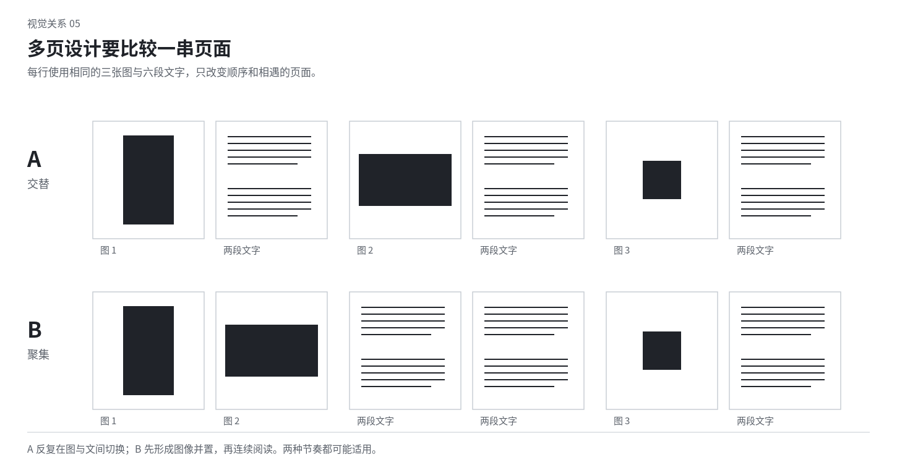

# 08 编辑与出版设计：页面之间也有构图

一本书、一份图录或一篇长文不是许多独立海报的集合。它需要持续阅读、定位、比较、翻页与停顿。单页要成立，前后页和整套内容也要形成节奏。编辑设计让内容组织与视觉安排相互影响，但不得为方便排版擅自改写事实或删去必要内容。

## 先辨认内容的结构

区分正文、章节名、作品名、引文、图注、脚注、目录、页码和附录。它们的关系决定哪些内容需要相邻、哪些需要反复出现、哪些可以在视觉上独立。先排真实的一段长文和一组复杂图文，往往比只排一个漂亮封面更能发现问题。

图录的图片有原比例和作品关系，文章有论述顺序，访谈有说话人切换，参考手册有检索需求。不要把这些不同结构都压成相同的卡片。版式需要回应内容的使用方式。

若材料没有清楚层级，可以先根据已知内容提出组织假设，但不把假设当成作者原来的结论。设计可以改善查找，不应偷偷重写论证。

## 页面尺寸与比例会改变阅读

开本决定手持、携带、图像尺度与文字行长。更大的页面能容纳大图，也可能让正文行太长；窄页可形成紧密阅读，也可能迫使长标题不断断行。先结合内容体量和观看方式，不按“更大更高级”选择。

图片占据整页时要看裁切是否损失作品。原比例不适配版面，可以通过留白、跨页、分图或邻近内容发展关系，而不一定强裁。Vignelli 对书籍网格与序列的讨论可作为参照，但其个人比例与字体偏好不是普遍要求。[S02](sources.md#s02)

屏幕长文没有固定纸页，但仍有视口和阅读长度。一次看到多少标题、图片和正文，会影响节奏。不要只把纸页纵向接长，忽略窄屏与交互的阅读条件。

## 跨页是一个整体，装订缝是真实边界

两页展开后，左右之间的关系会改变视觉重量。左页大图与右页小字可以互相支撑；两页都有同样大的标题则可能彼此争抢。把跨页作为整体看，再检查每页独立阅读是否仍可理解。

装订缝可能遮住图像、使直线偏折，也会改变内侧空白的实际感受。人脸、关键字、细线交点或需要比较的数值，不宜无意落在难以看见的部分。某些跨页图像可以利用中缝，前提是实际装订和观看方式允许。

满幅跨页不自动优于两张独立图。横向图适合延展，两个细节图适合比较；一整片空白也可以与另一侧形成等待。选择具体关系，不把每个跨页都塞满。

## 正文系统先保证长时间成立

正文要在行长、字号、行距、段落标记与对齐之间取得相容关系。可以从一组真实段落开始，加入长词、数字、标点、引用和小标题，观察其稳定性。只用短占位文字看不出长篇问题。

段落太堵时先看行长和行间；段落过于碎时看段距是否太大、是否重复使用缩进和分隔线。不同正文类型可以有不同语气，但不应每页随意变化。

孤行、孤字和标题与正文分离会打断关联。优先在局部调整换页关系或少量空间，不为一个页面把全书字距压窄。中文相关排版是具体的文字处理问题，并非某一种风格的专属要求。[S11](sources.md#s11)

## 图注与图像怎样建立可靠关系

图注应能被对应到正确图片。可以靠距离、共同边缘、编号或稳定的次序建立关联。图片很多、图注集中在页底时，编号尤其需要清楚；只有两张图时，强加复杂编号体系可能反而多余。

把图注放得很小不等于视觉退后。可以用位置、字重、行长和稳定区域让它不抢画面，但仍可读。图注包含作品尺寸、作者、年份等准确内容时，不应因排版缺位而省略关键单位。

一个跨页多幅图，可以把图注沿外侧形成细窄带，使图片区保持连续；也可以将图注紧靠各图，强调一对一。哪种方式适合，要看读者是在连续观看还是频繁查找。

## 导航是安静但可靠的身份线索

页码、页眉、章节名、目录与索引提供定位。它们可以成为整本出版物的稳定声音，使主图和章节页有更大变化空间。不要为了每页新鲜就不断移动页码，让查找变成猜谜。

稳定不要求永远同一坐标。章节开篇可以暂时省略页眉，图像页可以采用另一种相容安排，前提是读者仍能理解位置。艺术书也可以故意挑战导航，但应知道这对阅读造成的代价。

目录不必只是机械罗列。层级、缩进、行距和对齐可以使结构清楚；页码也可以建立稳定列。但不能为了图形整齐，把不同层级压成同一权重或省掉真实条目。

## 页序通过信息量与尺度形成节奏

连续满幅大图会逐渐形成强烈的节拍，也可能使每张都失去差别。连续小图加正文则可以供人细读，也可能过于平均。安排节奏时比较图像尺度、文本量、密度与空白如何从一页到下一页改变。

教学设想：一组修复工艺资料可以先用整体图建立对象，再进入数页细节与说明，随后给一次较完整的动作图。另一种艺术图录可以先呈现难以辨认的局部，翻页才给整体。两者的顺序服务不同观看，不是固定的“先总后分”。

整本都追求每页的冲击力，容易让各页互相抵消。可以让某些页只承担连接和持续阅读，把尺度变化留给真正需要的地方。安静页也应有精确排版，不是随便留空。

图中矩形只是内容密度与跨度的示意。它说明单页变化和跨页变化可以组合，不指定真实出版物必须采用这种顺序。

## 翻页可以揭示、延迟或反转

一个图像在右页边缘被切断，下一页出现另一部分，会产生期待；但如果下一页的连接毫无依据，可能只是无意裁切。设计翻页关系时，看前一页留下了什么线索，后一页改变了什么读法。

文字也可以利用翻页。问题与回答分开、作品正面与背面分开、巨大的一个字延伸成后页纹样，都有空间。教学与操作说明则需要保留必要的连贯，不为悬念隐藏使用者必须知道的信息。

屏幕中的滚动和点击可以借用揭示方式，但不是物理翻页的机械复制。视口高度变化、用户可中途跳转，都会改变前提。保留关系时要适配媒介。

## 图像编辑：并置是一个新的陈述

两张图放在一起，会使人比较颜色、姿态、事件或时间。原本无关的图片并置后可能被理解为有因果或同一场景。纪实内容要避免制造未经证实的联系；艺术拼贴则可以明确以形式联想工作。

挑选图片时，既看单张质量，也看前后关系。五张都属于同一景别、同一角度和同一色调，可能缺少发展；一组强反差也可能无法连接。可以通过重复的细节、共同边缘或明确的章节区分来组织。

不要因为需要填满一格，就加入质量或意义明显薄弱的图。可以改变空白或跨度，也可以让一张图真正占据更大空间。设计不是把所有格子填满。

## 封面、书脊、封底与内页是一件物体

封面决定第一次接触，但书脊可能是在书架上最常见的部分，封底和内页承担另一种阅读。可以让一条线、字形或色域贯穿不同面，也可以让它们形成转折。不要只完成正面效果后把其他面当空余位置。

书脊厚度与装订相关，不能凭主视觉比例随意设定。封面边缘的图形可能在折口或书脊处改变，文字也可能因弯折而难读。纸张、压纹、透明封套与内页透印都可以参与美学，但需要区分实际可实现条件与数字示意。

封面与内页可以强反差，但应有可解释的阅读关系。例如外部平静，翻开后密集；外部浓烈，正文稳定。不要让内页完全退成通用模板，只靠封面承担所有个性。

## 多页系统中怎样允许例外

稳定的正文、页码和图注，可以让章节页、插页与图像跨页更自由。变化不必每页发生；当内容确实改变时，版式才改变得更有意义。对极具实验性的出版物，内容本身也可以由连续变化构成，此时仍要设计变奏而非随机。

相似内容应有足够共同关系，方便读者比较；不同内容不必硬塞进同一种图文比例。规则太细会限制内容，规则太少会失去身份。先找少量重要稳定项，再发展变化范围。

## 检查一本出版物时的具体问题

除了单页好不好看，还看跨页是否冲突、前后页是否只重复、正文是否稳定、图注是否对应、读者能否定位，以及折叠装订是否改变了预期画面。检查不能只停在封面或几张展示效果图。

局部练习：保持六组内容不变，分别做成全等重复、按密度递进、以一个安静跨页打断三种页序。比较读者在哪处停留、哪处快速通过，哪种最适合内容。无需为证明节奏而给每页换字体。
