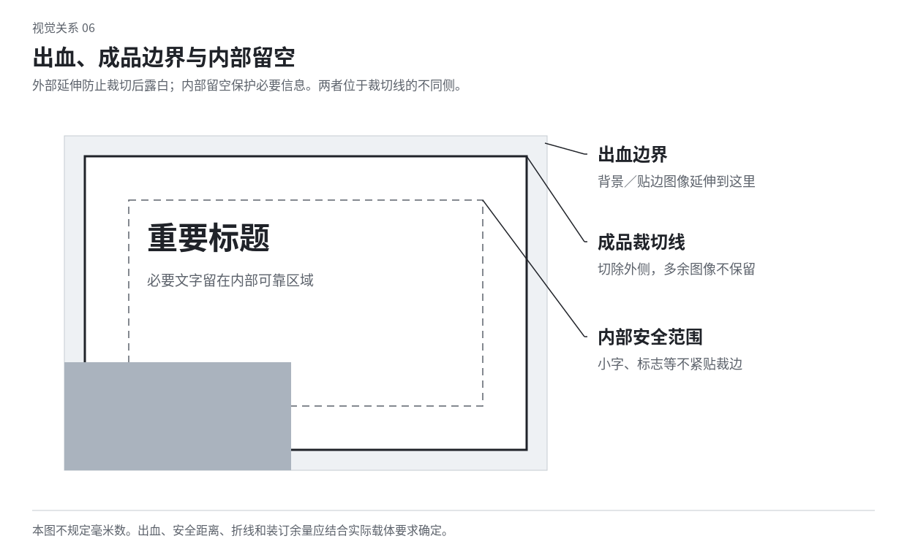

# 10 平面作品的材料与载体

平面作品会被印在纸上、贴在墙上、折成封套、绕过包装侧面，也可能只在屏幕上出现。材料、尺寸与观看方式会改变边缘、颜色、文字和图像的感受。本章讨论这些条件怎样进入设计，不提供某一软件的导出流程。

## 先分清设计意图、屏幕模拟与实际成品

一张带纸纹的数字海报可以采用印刷语言，但它并不因此拥有实体的触觉。一幅三维封面效果图可以帮助看折叠关系，但不能证明真实材料会按同样方式反光。描述时区分模拟效果和已确认的载体条件。

面向真实印刷时，纸张、印刷方式和加工条件应成为视觉选择的边界。面向纯数字展示，则可以借用这些关系进行再创作，不需要伪装成真实印品。两种目的都成立，但不能混称已经验证。

## 纸不只是米白背景

纸有底色、平滑程度、厚薄、透光、吸墨和反射差异。粗糙未涂布纸、平滑涂布纸、透明薄纸会让同样图形呈现不同边缘与层次。设计可以从这些性质开始，而非统一添加一层纸纹。

粗表面可能让细部与墨色呈现更不均匀的关系；透明纸可以让下一页参与当前画面；较厚材料会在切口和折叠处显出体量。选择一项真正影响观看的性质，再发展字形、空隙或叠层。

教学设想：一份关于风的折页，可以让薄纸背后的印迹若隐若现；若字本来需要快速辨认，则把核心信息放在较可靠的层。材料带来的含混可被利用，但不该无意毁掉必要文字。

## RGB、CMYK与专色解决不同颜色条件

RGB 描述以红、绿、蓝通道组织的颜色数据，常用于屏幕与数字图像；CMYK 对应青、品红、黄、黑四种过程色通道；专色使用独立指定的墨或颜色通道。它们都不是“高级或低级”的分类。

屏幕发光与纸面反射不同，某些明亮颜色不能用某一印刷条件完全复现。不同设备与材料能呈现的颜色范围称为色域；颜色配置文件帮助说明与转换这些条件，不能保证所有设备看起来绝对一样。[S19](sources.md#s19)

不要把“转成 CMYK”理解为颜色自然正确，也不要只为让图看起来鲜艳就交付没有说明的模拟。实际颜色以相应条件和样张为依据。数字作品可充分利用发光色，实体作品则可发展纸色、墨层与相邻关系的魅力。

## 叠印与挖空：重叠区域不是自动的

两块图形重叠时，可能让上层区域覆盖、挖掉下方墨色，也可能保留两层墨的叠加。挖空倾向于保留上层自己的颜色，叠印则让重叠区参与新的色彩关系；实际结果取决于墨、纸与方式。[S17](sources.md#s17)

设计叠印时，把重叠区域当成第三种形。两块色只是擦到一角，与长距离交叉，会产生不同的分量。可以让文字笔画和图像共享一块颜色，也可以让错位露出边缘。

叠印不是把所有图层降低透明度。屏幕混合模式是模拟，实体墨层也不是同一种光学过程。要声称具体颜色能被印出，需要相应的实际依据；教学示意只说明关系。

## 套准、错位与补偿

套准指不同颜色或工序的位置对应。微小误差可能让边缘露出白缝、产生重影或改变细字。设计需要清楚哪一部分必须精确，哪一部分可以允许或主动采用错位。

如果想利用套印错位，可以让偏移方向和幅度形成可感规律。只在图像边界发生的偏移，与把所有正文也重影处理，阅读代价不同。保留清楚的信息组，不必消除整件作品的印刷性格。

为避免相邻色块间露缝，实际生产可涉及微小重叠补偿，具体由印刷条件决定。这里不设统一数值。把这种现实限制理解清楚，便能避免把不可能稳定生产的极细相接当成唯一效果。

## 网点、线纹与纹理的尺度

印刷中连续调子可以由点或线的疏密、大小关系表现。艺术设计也可以把这些点直接放大，让它们成为纹样、边缘和色域。网点不是“加一点颗粒”的同义词。[印刷关系参照](sources.md#s17)

纹理要相对于画幅和文字看。很小的颗粒在缩小后可能消失，过大的颗粒则可能与小字竞争。规则网点被再次缩放或与别的规律纹理叠加，还可能出现不希望的干涉图案；看到条纹时先检查尺度与叠加，而非继续增加清晰度。

模拟印刷时可以刻意改变密度、角度和边界，也可以让某些层保留硬边。不要将所有素材都统一噪点化，导致材料差别完全消失。

## 出血、成品边界与内容安全空间

出血指背景或图像向成品裁切线外延伸的部分，用于应对裁切偏差。成品边界是最终可见尺寸；内容安全空间则在它里面，帮助重要文字避开裁切或装订影响。三者不是同一条线。[S18](sources.md#s18)

例如某一印刷项目要求边外延伸 3 毫米，这是该项目的条件，不是所有载体统一的美学值。背景延伸到外面，仍需单独考虑内部文字离边多远。让标题贴边可以有力量，但不能无意让真实裁切吞掉关键笔画。

图中距离仅用于解释三个区域，不表示印厂规格。看实际作品时还要考虑装框、折叠或其他遮挡。

## 清晰度取决于实际使用尺寸

图像像素数与印出多大共同决定单位长度内的像素密度。有效 PPI 可按使用方向上的像素数除以英寸数计算。2400 像素的图宽印成 8 英寸，有效 300 PPI；印成 16 英寸，有效 150 PPI。若裁切后只剩 1200 像素却仍印 8 英寸，也只有 150 PPI。

把文件里的分辨率标签改成 300，并不会凭空增加原始细节。需要看实际像素与使用尺寸。近距离印刷常采用较高分辨率，远处大型画面可按观看距离作不同选择，不能把 300 PPI 当成所有媒介必需或足够的保证。[S20](sources.md#s20)

矢量轮廓可以在变化尺寸时保留几何清晰，但线条与缝隙仍可能因实际印刷、屏幕或观看距离而失效。数学上存在一条极细线，不代表观众能看见。

## 大色面、细字与深色的不同处理

大色面需要看是否均匀、是否与纸的表面关系匹配；细字更依赖边缘与套准。用于铺大面的深色处理，不应不加区分地用于每个很小的字。具体通道与墨量取决于生产条件，不在这里给出万能“高级黑”配方。

白字反出在深底上时，细笔画和小开口可能受影响。可通过选择合适字形、扩大尺寸或调整字腔来保留辨认，而非全体增加描边。大标题则可以充分利用黑白与边缘的力量。

如果作品主要靠低对比颜色，印刷中轻微变化就可能影响差异。可以发展面积、边界和纸面处理提供额外线索，不一定把整体变成高对比，但应知道哪些差异真正重要。

## 折叠、切口和包装面会参与构图

平面展开图上的连续线，折起后会经过转角；字跨过折线后可能变成两段；窗口会让内部产品成为图像的一部分。设计时同时想象展开、折起和被手拿着时的关系，不只美化正面矩形。

包装正面、侧面和开口可以承担不同的信息层级。巨大形可以跨面延续，准确名称与必要信息留在可靠区域；开启过程也可以逐渐揭示图形。不要在没有依据时更改真实尺寸或结构，只为数字效果图看起来漂亮。

书籍的透明封套、折页的顺序、卡片的打孔和边缘切形，同样能发展形式。用它们改变看见与遮挡的关系，而不只是添加昂贵加工名词。

## 光泽、压凹和金属效果不等于自动高级

局部光泽可以让同色区域在不同角度下显现；压凹可以使边缘与触觉进入观看；金属材料可以反射环境。这些效果依赖光、角度和实际材料，并不是纯色块上加渐变就能证明。

选一种工艺时，先问它让哪一处关系更可感。例如同色标题通过压凹显露，可以保持克制；整页金属反射则可能成为浓烈的主体。没有必要把烫印、压纹、厚纸和磨砂全部叠加。

本章练习：同一图形分别设想为屏幕发光、普通纸面、半透明薄层。指出每种条件下必须重新考虑的颜色、边缘和文字关系。不要只换一张背景纹理。
