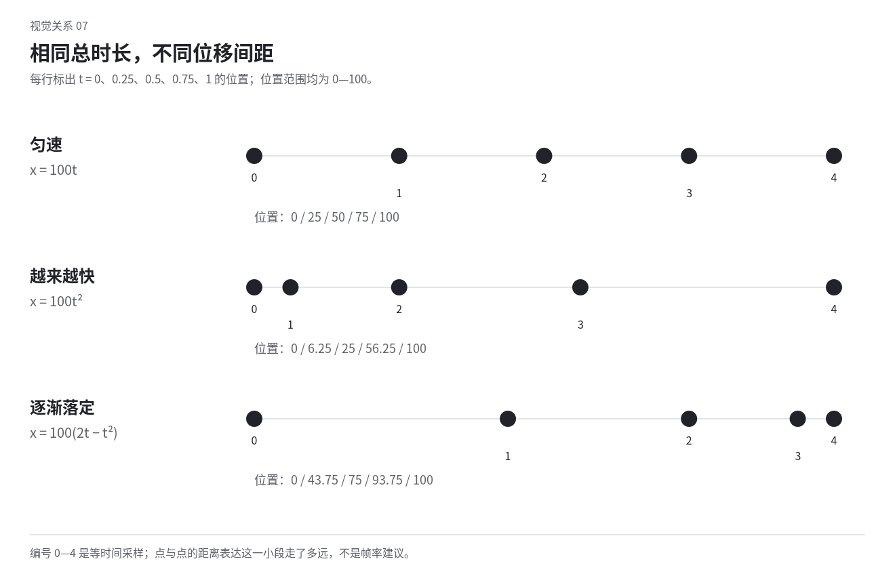
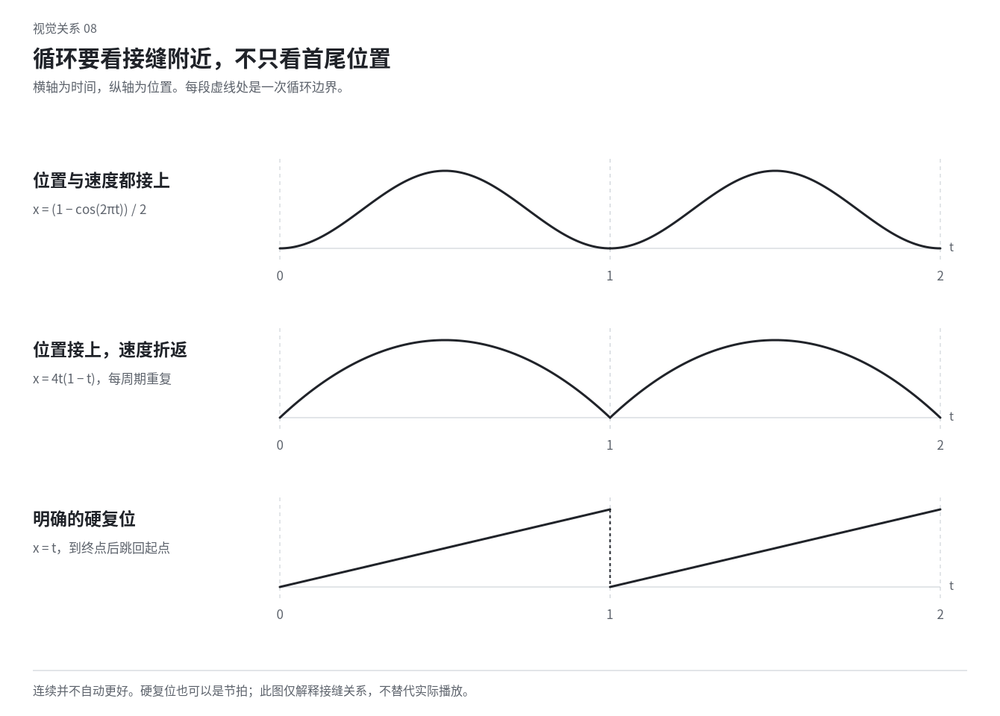

# 13 动画与运动设计：把时间变成形式

动态设计首先安排变化如何发生。对象怎样接近、等待、接触、分离、积累和消失，比给每个元素选择一种入场特效更基础。顺滑、弹性、写实和持续活动都只是选择，离散、僵硬、笨拙或近乎静止也能有鲜明美感。

## 先看整段发生的关系

同样一组形，可以逐渐挤占空处，也可以不断寻找接点；同样一条线，可以重复擦除，也可以留下越来越厚的痕迹。静态元素没变，时间组织已经改变了作品。

先确定画面开始与后续状态之间真正的变化，是密度、空间、身份、信息还是期待。不是所有动画都需要故事，但需要一种可感的变化或持续观看。没有变化的长时间保持也可成为选择，取决于构图、细节和等待。

教学设想：一条线每次伸长，尾端保持原位，随后尾端突然被拉走。先前的增长因此可能像积蓄。若每次只是同样弹入弹出，关系便不同。应先选事件，再选缓动。

## 时长与位移间距是两种变量

时长说明动作持续多久。位移间距说明相等时间里对象走了多远：间距大处快，间距小处慢。两个动作可以同样长，却有完全不同的启动与结束。

下面以总路程 100、总时间 1 为单位，用三个简单函数说明关系。它们是数学示意，不是推荐所有动画采用的曲线。

| 时间比例 t | 匀速 100t | 后段加快 100t² | 前快后缓 100(2t−t²) |
|---|---:|---:|---:|
| 0 | 0 | 0 | 0 |
| 0.25 | 25 | 6.25 | 43.75 |
| 0.50 | 50 | 25 | 75 |
| 0.75 | 75 | 56.25 | 93.75 |
| 1 | 100 | 100 | 100 |

三者经过同一终点，但中途位置不同。后段加快的示例到终点时仍有速度，直接接静止会形成急停；想柔和落定，需要另安排末段。前快后缓的示例则一开始就有速度，不等于从静止自然起步。

看图时比较圆之间的距离，而非只看起点终点。图中没有运动播放，不能据此判定某段真实动画已经自然。

## 路径与速度应分开考虑

同样的快慢可以沿直线、圆弧、折线或有意不规则路径进行。直线可以直接、机械或强硬，弧线可以绕开障碍、表现转动或延长空间，不等于所有自然动作都必须圆弧。

对象沿曲线路径走时，如果各段参数均匀不代表实际距离均匀，可能出现不希望的忽快忽慢。审美上要看是否符合想要的性格，不仅看曲线本身光滑。

路径中一处突然转折可以成为事件。若转折前没有减速却又想显得柔和，就需要调整；若目标是硬碰硬的折返，则可以保留急变。不是所有急停都要“优化”为缓动。

## 支点与接触让动作有结构

门绕铰链，招牌绕悬挂点，纸先固定一角再翻起，动作关系不同。对象先平移再随便旋转，未必像围绕支点运动。看哪一部分被固定，哪一部分带动其余部分。

被拉动的柔软材料可以让接触点先动，远端跟随；刚性对象则应整体响应，不能每个角都独立弹。抽象图形可以不服从现实重力，但仍可用共同转轴、连接或方向建立关系。

接触是重要时刻。物体到桌面后，底部是否稳定？纸中心落定后，边缘是否还有反应？球看似撞墙却穿过边界，除非有意转化，否则会破坏碰撞的读法。

## 重量由多种线索共同表现

石块保持稳定轮廓、明确接触、短促落定，可以显得沉；薄纸中心先停、边角继续折转，可以显得轻。二者主动作时长相同也能不同。重量不只等于慢，轻盈不只等于弹。

起步、停止、旋转、接触后的反应都参与。硬物也能反弹，软物也可突然锁定，需结合对象的外观和情境。不要按材料名给一套固定参数。

可以故意交换行为：石头像薄纸折起，金属环像布下垂。保留识别线索，让反差可感；如果外观和运动都变成同一种无差别软体，就可能失去这种趣味。

## 准备、主动作、跟随与重叠

准备动作让后续意图先被感到，例如身体降低后跳起，形向内聚集后扩散。它可以更清楚，也可以更有性格，但不必每次都先反向弹一下。高频按钮操作不应因准备表演迟迟没有反馈。

跟随是主要部分动作后，其他部分继续回应；重叠指不同部分的动作在时间上交错。衣摆、边角或关联对象可以后停，刚性结构不应被无理由地分裂成橡胶。

IBM 对动画原则的改写提供了把准备、节拍和动作关系用于图形语境的参照，其品牌幅度和速度不能当成全部动画规范。[S25](sources.md#s25)

## 注意力是随时间转移的

同一时刻背景、标题、标签、粒子都大幅运动，会争抢注意。可以让主事件先建立，让其他部分响应、稍后出现或暂时静止；也可以选择密集并发，但需要有共同方向或节律。

一个数据片段可以先出现变化的曲线，再让标记与值进入，随后保持阅读。不是机械等前一个完全结束，多个动作可以重叠。重点是读者何时能看清需要理解的信息。

文字在动不等于不可读，也不等于始终可读。短标题可在动作中被识别，长段落通常需要稳定时刻。不要把所有字逐个飞入，直到片尾才第一次形成完整句子。

## 用重复、偏离和缺席安排节律

三块形依次落位，第四块迟到后挤入，和第四块始终停在边缘，是不同事件。重复建立期待，提前、延迟、取消与拒绝完成改变期待。这里的趣味来自关系，不仅来自总时长。

不必永远先整齐再破格。可以一开始使用不同长短的保持，由相近姿态、重复颜色或共同方向连接。若每个时刻都随机变化，观看可能只剩噪声；需要噪声般密度时，也应选择其频率与分布。

停顿不是空闲废料。圆停在窄口前，下次变化只发生在窄口，圆仍不动，期待可能更强。静止中需要可看的姿态、细节或未完成关系，而不是任意延长素材。

## 离散姿态与连续运动都可以成立

离散动画在若干选定姿态间变化，连续动画则补出更细的过渡。NFB 对 McLaren《Blinkity Blank》的介绍提供了间歇图像组织的参照；这不要求复制快速闪烁，也不说明任何具体刺激频率安全。[S26](sources.md#s26)

24 帧每秒的序列中，每张姿态保持两帧，在这一安排下每秒可以有 12 次姿态更新；这与直接降低整个视频文件帧率不同，也不代表所有对象必须同一节拍。Sony 的制作说明讨论过类似的离散姿态选择，具体影片处理比单一数字丰富。[S23](sources.md#s23)

姿态之间需要选得有力。随机丢帧、无意闪烁、身份漂移不会自动成为手工感。反过来，也不要为了“更丝滑”把所有精心选择的跳变插成连续。频繁亮暗闪动有额外风险，不能把艺术意图当成安全验证。[S34](sources.md#s34)

## 形变需要对应，也可以选择失去对应

圆变方时，哪些位置仍让人看作同一对象？字的开口、图标的接点或一段轮廓可以保持联系。随机将无关顶点互相连线，常会造成不必要的穿插和混乱。

有意溶解可以让对象失去对应，但要安排何时仍可辨、何时进入抽象、何时重新形成。形变的中间态也可以独立有趣，不必只是连接两端的工具。

挤压与拉伸可以保留大致体量，也可以故意改变体量；具体由动作语言决定。不要给所有物体统一拉扁回弹，也不要把保持体积写成所有抽象变形的硬条件。

## 动态字体按词句与字形组织

字可以伸展、拆分、重组、抖动或作为纹样移动。先决定观众是在读一句话，还是看一组字形。短语中的语义单元可以一起出现，某个字形结构则可以独立变形。

例如“慢一点，看清楚”可以先完整出现，再让前半句字距打开而后半句稳定；也可以用反差，让“慢”迅速切入而其余部分保持。选择具体时间关系，不预设文字一定要按字面意思运动。

若字要作为可读信息，在必要时刻保留骨架、位置和对比。若字成为纹样，可延迟辨认；但辅助日期与导航不必一起失去可读性。

## 循环检查状态，也检查速度与事件间隔

首尾位置相同不保证接得自然。接缝前后的速度、方向、亮度、姿态和保持时间都可能突变。连续循环可以让这些关系相容，节拍式循环则可明确重启，让硬切成为作品的一部分。

漂浮对象可以错相，集体呼吸可以同步，纹样可以穿过边界，而非总要往返。决定哪种整体节拍有用。若每次循环在接缝多停一拍，可能是想要的停顿，也可能是意外。

示意图只解释接缝关系。真实的流畅、停顿与舒适度需要对应的时间观察。

## 交互中的运动可以被中断

用户再次操作时，视觉应从当前状态继续、转向或结束装饰，不应无故跳回原点，或强迫看完整段表演。拖动优先跟随当前输入，释放后再处理落点。

过程可以被省略，只要对象与状态的关系仍清楚。Google 的历史设计访谈中有通过整组移动与淡变减少重排交叉路径的说明，可借鉴省略无关过程，而非复制特定产品当前实现。[S28](sources.md#s28)

减弱非必要动效后，反馈仍应存在。关闭交互触发的非必要动画属于 WCAG 2.3.3 AAA 的相关范围，不应误称统一的 AA 要求，也不能替代全部无障碍检查。[S31](sources.md#s31)

本章练习：同样一个矩形到达同样位置，分别只改速度分布、支点、接触后的反应。描述性格怎样改变。静态路径和采样表帮助分析，不能冒充已经播放并验证的动画。
