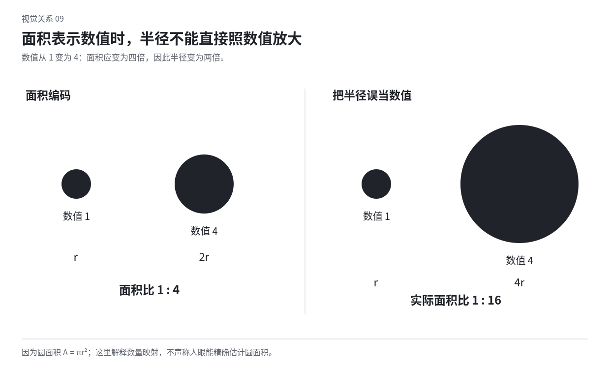

# 16 信息设计：让准确的关系也有形式

信息设计将数据、步骤、结构与关系变成可看见的形式。它可以清楚、密集、富于装饰或允许探索，但数值、单位、对应与必要语义应可靠。视觉个性可以进入编码和组织，不能靠失真的大小与比例制造冲击。

## 先确定要比较或理解什么

需要比较数量、变化、分布、构成、位置，还是对象之间的关系？问题不同，合适的图形也不同。不要只因某种图表好看就把所有数据塞进去。

同一份数据可以有多种读法。展示每项数量可用共同基线的长度；看随时间变化可看位置与线；看个体分布可保留点；看组成则要说明整体是什么。先把读者要回答的问题写清楚，再选择表达。

图表中的标题、注释和单位也是内容，不是最后加上去的装饰。没有数据范围、时间或口径，漂亮图形可能无法被正确理解。

## 视觉编码是什么

编码是把某种数据关系对应到某种视觉关系，例如数量对应长度，类别对应颜色，时间对应横向位置。相同含义使用稳定编码，不同含义避免无意混用。

位置、长度、面积、角度、颜色、形状与纹理各有特点。需要精确比较时，共同参照往往很重要；需要整体模式或艺术探索时，可以选择更丰富的编码，但需要让读者知道怎样读。

不是每一种差异都要加颜色。位置和标签已能区分的对象，再各给一种强色，可能增加重复工作。颜色也可以本来就是主题，不能因为可少用就一律改成中性。[S29](sources.md#s29)

## 数值变成长度时，基线不能含混

柱形通常用从共同基线起的长度表示数量。若数值 100 和 110，从零画出长度只差一成；若把轴截到 90，剩余长度会变成 10 和 20，看起来像两倍。改变基线会改变长度对应的含义。

希望突出小差别，可以换成点图、差值图，或在明确说明的尺度上比较位置，不必把完整数量柱截短。Datawrapper 的相关说明区分了柱形长度与折线位置的用途。[S29](sources.md#s29)

折线并不总需要从零开始，因为常比较的是相邻位置和变化。但需要让轴范围清楚，不能刻意隐藏范围把微小变化画成巨大波动。采用哪种范围取决于问题，并应说明。

## 面积不能用半径直接替代

若圆的面积代表数值，面积与半径平方成正比。数值四倍，半径应为两倍；半径四倍，面积会变成十六倍。这是数学关系，不是审美偏好。

可用 `r = k × √v` 把非负数值 v 映射到半径，k 控制整体尺寸。用二维图标整体缩放时也要看面积变化，不能只凭“看起来更大”编码数量。

图中的比较只解释面积映射。实际图表还需要标签、范围与背景，不能仅靠两个圆让读者猜值。

## 时间与连续性要保持对应

折线把点连接起来，会暗示它们之间存在某种连续或顺序关系。时间间隔不相等时，横向位置也应表达这种差别，除非明确使用的是序号而非真实时间。

缺失值不能无意填成零，也不能随意连线掩盖空缺。可以留断点、标注未知或另作处理，按数据含义选择。图形上的平滑可能暗示并不存在的中间趋势，不能只为好看而过度平滑。[S29](sources.md#s29)

周期数据、累积值、增量与比例有不同含义。先确认数据是什么，再决定线、面积和坐标。图形整理不能替代口径判断。

## 排序与分组也是设计决定

按数值排序便于比较高低，按时间顺序保留过程，按类别分组强调归属。不同排序会改变读者首先注意的关系。不要为了形状整齐把数据随意挪动而不说明。

组内与组间的距离、标签和共同背景可以提供结构。需要跨组比较时，要保持尺度一致；需要每组内部模式时，可以使用小多图，但需标明是否共享尺度。

密集信息不一定需要删减。通过分类、对齐、重复与局部强调，可以保留细节而形成整体。艺术图谱可以供人慢慢读，但必要图例不能藏成猜谜。

## 标签、图例与注释形成阅读路径

标签靠近对象可以减少来回查图例，图例则适合重复类别和复杂编码。选择哪种要看空间与信息量。把图例放到很远处，或使用相近符号而没有清楚说明，会增加辨认成本。

标签不必都同样醒目。主要结论可以明确，局部值和说明退后，但仍可读。注释应指出具体位置与事件，不能只写一句夸张结论让图为它背书。

单位、基数、时间和数据来源应有可靠位置。艺术性可以进入字形与排列，不应使这些信息变得无法解读。没有数据来源时，说明数据是示例，不给它伪造权威。

## 图表的颜色先看数据含义

类别色用于区分不同组；连续色阶用于表示程度；发散色阶通常围绕有意义的中点变化。中点可以是零、目标或其他有依据的参照，不能为配色漂亮随意设定。

两个含义不同的类别可以用不同色相，但颜色还应在实际面积和底色上可辨；连续值的颜色应有可理解的次序，避免某个中间色意外最醒目。必要区分还可依靠标签、形状或位置。[S29](sources.md#s29)

不要给每根柱子随机配色，除非每根确有不同类别意义。也不要因为“专业”就把所有图都做成灰色，仅保留一个亮点。实际任务可以需要丰富颜色。

## 示意图中的线与箭头应有明确含义

线可以表示连接、先后、包含、路径、影响或尺寸，但同一图中不要让它无意承担互相冲突的意义。箭头尤其需要说明方向代表什么，不把所有关系都画成单向因果。

连接线经过哪些节点、在何处交叉，决定读者怎样理解。可以通过布局减少不必要交叉，或明确跨线而不相连；如果交点表示连接，则用一致方式标记。装饰曲线不应与真实连接线混淆。

节点形状可以体现类别或层级，也可以保持统一让位置承担区别。不要为每个节点选不同造型，却不提供任何可理解的语义。

## 地图与空间图需要分清准确位置和示意关系

地图可以重视地理位置，也可以重视路径、连通与顺序。示意路线图为了读清连接，可能调整距离与角度；实际地理比较则不能无意保留这种变形。应明确图的用途和简化程度。

面积、距离和方向在不同表示中可能被改变。不要因为某块颜色在图上很大，就默认对应人数或数量更多；也不要将路线图上的等间距节点当成真实等距离。

设计美感可来自线网、符号、标注与色域。准确性规定哪些关系不能改，剩余形式仍有空间；它并不要求所有地图都同样中性。

## 数据艺术如何保留可读的依据

数据可以发展成纹样、图谱或具有个人感的符号。让数据的类别、次数、方向或节律参与造型，形式就有可追溯关系。也可明确将数据作为创作输入而非精确比较工具。

此时要说明哪些关系保留、哪些被转换。若只是用数据种子生成抽象图，不应称为能读出具体数值的图表；若图形能解码，则提供实际可用的图例。丰富表达与诚实标注可以同时存在。

不能因新奇而忽略识别代价，也不能因辨认需要时间就直接判为失败。根据作品是供快速决策还是持续探索来判断。

## 动态信息应当保住比较参照

动画可以揭示一段变化、连接状态或帮助观察，但让所有数值不断漂移，可能使比较困难。可以保留坐标、类别或已有轨迹，让变化有参照。

某个阶段需要读值时，给出稳定时刻或可查位置；不让所有标签在高速运动中消失。数据点重排时，决定是否要保留身份连接，或用清楚的新结构替代复杂迁移。

动态增长也不能改变准确比例。图标弹性可作为反馈，但停留用于比较的状态应对应真实值。艺术变形与数据编码应分清。

## 诊断时同时看准确与表达

图表准确但平庸，可以发展标题、标注、分面、间隔与整体色域，而不是扭曲数值；图表很有气质却难读，可以修图例和编码，不必把全部符号换成无个性的默认样式。

局部练习：用 10、20、40 三个示例值，分别以长度、圆面积和位置表示，并写出映射关系。再增加两个类别与一处缺失值，观察标签与分组如何改变。数值只是教学输入，不代表真实统计。
